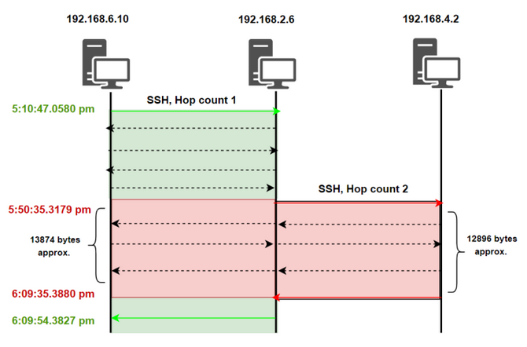

# Stepping-stone Detection : Data Collection.
<b>Key learnings:</b>
  - <b>Learning about different cyber attacks.</b>
  - <b>Designing and setting up different vulnerabilities.</b>
  - <b>Networking concepts.</b> 
  - <b>Python coding.</b>
  - <b>Data analysis.</b>

<h2>What is this project about?</h2>

This project is about detecting a cyber attack called Stepping-stone intrusions, where attackers use multiple computers to hide their true location. This project was done as a final year Capstone project. It was a team project, done by my team members and myself. In this project, a simulated network infrastructure of a hospital environment was created. This environment will be used to perform multiple cyber attacks. Network traffic generated from this exercise was collected to analyze, identify patterns, and find attack paths. The idea behind data analysis is to figure out how Stepping-stone intrusion attacks can be detected.

<h2>What is a Stepping-stone attack?</h2>

A Stepping-stone attack is when a hacker uses a series of computers to hide their real location while launching an attack. They "hop" through these computers like stepping stones, making it harder to trace where the attack is coming from.

  
  <h2>Project Setup.</h2>
  
  <h3>Phase 1: Generating Network traffic</h3>
  
The goal of this project was to understand how Stepping-stone attacks work and how they can be detected. The first goal was to create a Stepping-stone attack scenario. This would allow the extraction of network traffic that can be utilized in studying how Stepping-stone attacks work from a network point of view. Network traffic is essentially the simplest form of analyzing how two devices on a network communicate. Understanding the communication would explain how attackers pivot or hop from one device to the other. Hence setting up a real-life organizational network infrastructure and analyzing its data was an essential phase of this project.

  
To study a real-life network traffic scenario, a similar kind of network traffic must be generated. A network infrastructure was designed and deployed as a Red Team vs Blue Team competition within our university. The design of the competition was simple, the blue team would defend their organization while the red team would attack the organization and move from one subnet to the other pivoting their way through to the final flag in the final network.

  
  <h3>Phase 2: Setting up the infrastructure.</h3>
  

      
      
Image 1: Network infrastructure diagram.

  

  
Image 1 is the network topology of the competition. The blue and red box indicates the teams (Blue & Red) and their respective Network Addresses. Green, Purple, and Pink boxes are different networks of the environment that will be used within the scope of the competition. The network consists of many different hosts with a mixture of Windows and Linux OS. These hosts ran different services such as SMB, SMTP, HTTP, and Active Directory (AD). The whole goal was to mimic a real-life organization that runs different subnets, hosts, and services. These hosts were set up and configured with different services and vulnerabilities in them.

  
  <h3>Phase 3: Data collection.</h3>
  
Prior to the commencement of the competition, packet captures in the background of all the hosts and routers were initialized. This was done to collect the network traffic. These were high volumes of data, around 15 GB of network traffic. The goal here was to collect a large amount of data. Larger network traffic will give you more accurate data to analyze.

  
  <h3>Phase 4: Analysis.</h3>
  
Python was used to analyze the packet captures. Python is a good programming language to be used for data analysis. Each packet capture was individually analyzed by Python to figure out multiple statistical insights. Multiple Python scripts were used to find out the amount of traffic generated from different subnets. These scripts gave insights into: the type of connections being generated by hosts and the amount of successful connections established between different hosts. All these stats were generated to study a pattern. Our analysis showed that SSH was used to pivot from one device to another. Our research paper has an in-depth analysis of each statistical data extracted from Python code. Different network traffic patterns have been discussed to find out how pivoting in stepping stones work. In short here is a brief explanation of our analysis which indicates how stepping stones can be detected.

  

    
    
Image 2: SSH connection between three hosts.

  

  
Image 2 is a depiction of how the Hops have a pattern that can be detected. Let's consider three Hosts H1, H2, and H3 present in three different subnets.

  
Let's say H1, H2, and H3 are in different subnets, and the attacker is using these machines to pivot from one machine to the other. Once H1 is compromised by the attacker, an attacker has SSH shell access to H1. The attacker will use the H1 shell to send an SSH request to H2. Once successfully logged into H2. Attacker has successfully pivoted from H1 to H2. This means that the data traffic is moving back and forth from H1 to H2. This is Hop count 1 (1st pivot). Now when an attacker wants to pivot from H2 to H3, the attacker will send an SSH request from H2 shell to H3 (SSH 2, 2nd Pivot). Bear in mind that the commands are being sent from the attacker who is still having access to H1. So the command will be sent from H1 to H2 through SSH 1 connection and from there H2 to H3. This provides a constant overlapping SSH connection between all three machines.
 
  
Image 2 shows the two hops. The two hops consist of an overlap of SSH connection with an equal amount of data bytes. This indicates that this is a pivot because the SSH connection is shifting from one host to the other. The attacker uses H1 to communicate with H2 but uses H2 to communicate with H3. Image 2 includes the timestamps to prove that all the SSH communications are happening simultaneously between the three hosts.
  
  
<strong>Note: The above explanation is drawn from analyzing the network traffic from our simulated attack infrastructure.</strong>
 
  
A detailed explanation of these results, based on its statistics, is mentioned in our research paper. Hence, if such a pattern is found among Hosts, they can be flagged to be investigated. Such a method of detection can be implemented on routers that foresee traffic between Hosts from different networks, hence routers can be a great point where This approach can be implemented to detect stepping-stone attacks.

